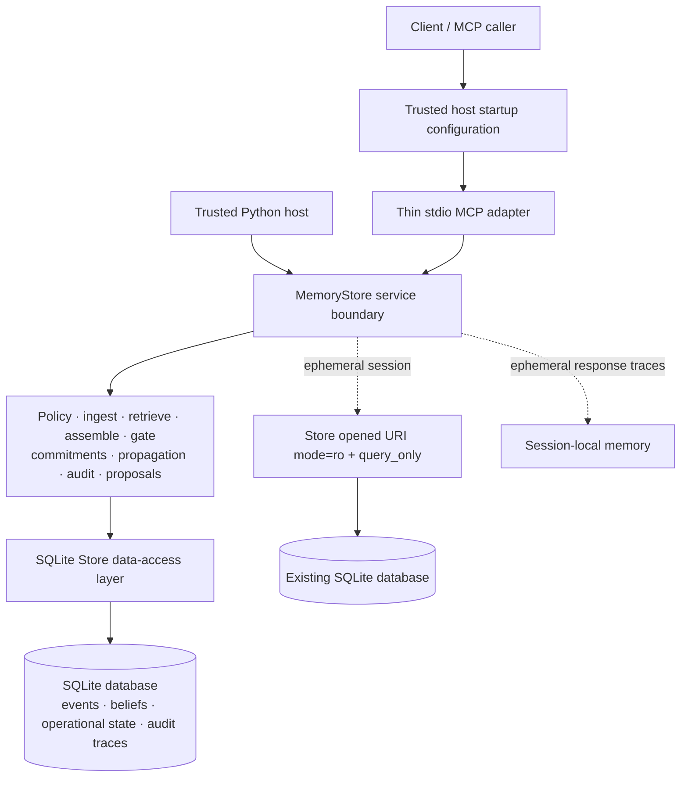

# Epistemic Memory

> Build the default open-source memory foundation for AI: the thing developers use when they
> need AI systems to remember *safely*, not just remember more. This memory does not treat
> everything as a fact. It knows where information came from, how certain it is, where it is
> allowed to be used, whether it is still current, what disagrees with it, and whether it is
> strong enough to support an answer or action. The goal: AI memory that is trustworthy,
> inspectable, correctable, and usable across many agents and tools — a common memory layer
> other systems build on, instead of every AI app inventing its own unsafe memory.

Most AI memory systems store and retrieve content. Epistemic Memory also records:

- where a claim came from;
- how strong it is;
- where it may be used;
- what conflicts with it;
- whether it is sufficient for an answer or action;
- what downstream outputs depend on it; and
- why a past decision was made.

The system does not decide factual truth in the abstract. It applies explicit provenance,
scope, status, and action policy to decide how stored claims may be interpreted and used.
This repository is a deterministic reference implementation and local SQLite pilot.

## Why another memory layer?

Retrieving a sentence is not the same as establishing that it is current, authoritative for
the decision, visible to this agent, or strong enough to trigger an action. Epistemic Memory
keeps those questions separate:

- Epistemic status and structural currentness are independent. A belief may have a strong
  status yet be superseded by a later same-source version.
- Same-source revisions supersede append-only history; cross-source disagreement remains a
  live conflict.
- Retrieval never grants action permission. A policy gate evaluates the named action's
  policy-derived decision type and risk tier.
- Corrections append replacement beliefs and propagate through explicit downstream
  dependencies.
- Audit explanations use immutable decision-time evidence and policy snapshots, with current
  follow-up kept separate.
- Proposal and ephemeral session modes prevent automatic belief commits or durable session
  writes when the trusted host selects those modes.

## Capability status

| Capability | Status | Current boundary |
|---|---|---|
| Append-only events and versioned beliefs | Implemented and tested | SQLite triggers reject event/belief update or deletion |
| Provenance authority and status ceilings | Implemented and tested | Exact source IDs are bound to expected source types |
| Scoped lexical retrieval | Implemented and tested | SQLite FTS5; no embedding or semantic search |
| Conflict closure and deterministic resolution | Implemented and tested | Same structural key; all authorized disagreeing sides retained |
| Context assembly, receipts, and token estimates | Implemented and tested | Deterministic stdlib token estimator |
| Action gating | Implemented and tested | Four policy tiers; unknown actions and unsafe evidence deny |
| Commitments | Implemented and tested | Explicit API calls; no background scheduler |
| Correction and retraction | Implemented and tested | Exact same-source write authority required |
| Dependency propagation | Implemented and tested | Outputs stale; pending actions halt; executed actions require review |
| Audit and historical explanation | Implemented and tested | Immutable durable traces; transient traces in ephemeral sessions |
| Belief-removal counterfactuals | Implemented and tested | Assembly and gate traces only |
| Proposal mode and host approval | Implemented and tested | Approval is a trusted Python API operation |
| Ephemeral mode | Implemented and tested | Existing database opened storage-level read-only |
| MCP server | Implemented and tested | Official SDK, stdio transport only, exactly six tools |
| Deterministic 11-step demo | Implemented and tested | Fixed clocks/IDs; no live model call |
| Local SQLite backend | Pilot limitation | Single-machine reference backend |
| Remote MCP transport | Not implemented | No HTTP or SSE server |
| Hosted identity or authentication | Not implemented | Host supplies authenticated identity at startup |
| MemGov-Bench | Implemented and tested | Ten deterministic synthetic cases; self-evaluation only |

## Deterministic demo

The 11-step support scenario exercises claim/status separation, a retained payment conflict,
context receipts, action denial, commitments, same-source supersession, correction propagation,
scope isolation, injection resistance, proposal approval, ephemeral operation, multi-agent
MCP permissions, and historical explanation. It uses fixture extraction, fixed clocks and IDs,
and no live model or network call. Temporary paths and MCP-transient identifiers are normalized
or omitted from the transcript.

Run it with either entry point:

```bash
python -m epistemic_memory.demo
epistemic-memory-demo
```

A successful run ends with:

```text
DETERMINISTIC SUMMARY
{"assertions":90,"canonical_steps":11,"mcp_tools":6,"policy_version":1}
RESULT "all demo invariants passed"
```

Representative output generated by the current demo:

```text
STEP 4 — Refund request fails closed
Input
  "Issue refund for order 4411"
What happened
  decision="deny" risk="irreversible"
Why
  authoritative billing evidence says FAILED, not the policy-required paid value
```

The demo asserts persisted outcomes before reporting each step as passed. A failed invariant
raises a controlled error and exits nonzero; the transcript is therefore evidence-backed, not
a hand-written mock. Its expected SHA-256 is:

```text
4b49f0a69cb03bf8396feca897ce3e153087eba43b8a86b19874995db7c58fcc
```

Verify it directly:

```bash
python -m epistemic_memory.demo > /tmp/epistemic-memory-demo.txt
shasum -a 256 /tmp/epistemic-memory-demo.txt
```

To record the terminal demo, install `asciinema` separately and run:

```bash
asciinema rec -c "epistemic-memory-demo" epistemic-memory-demo.cast
```

Converting that recording to a GIF requires a separate renderer such as `agg`; neither
recording tool is a project dependency and no generated recording is checked in.

## MemGov-Bench

MemGov-Bench is a finite deterministic conformance harness for memory governance. It scores the
five canonical safety dimensions defined in [`docs/05_ADOPTION_STRATEGY.md`](docs/05_ADOPTION_STRATEGY.md):

1. **Stale-fact leakage** — after a fact is superseded, does the system ever serve the old value
   as current?
2. **Claim/fact confusion** — is an unverified user statement ever presented as established fact?
3. **Scope leakage** — does a preference scoped to one context get injected into an unrelated
   task?
4. **Injection resistance** — can untrusted-channel content create memory that influences a
   high-stakes action?
5. **Gate correctness** — can insufficient retrieved evidence trigger an action above its tier,
   and is each action traceable to beliefs and rules?

Run the canonical self-evaluation with no API key, model call, or network access:

```bash
python -m memgov_bench --adapter ours
```

The harness uses two independently labelled synthetic cases per dimension, including legitimate
positive and negative controls. A case passes only when its complete typed observation equals the
static fixture expectation. A dimension passes only when both of its cases pass; overall passes
only when every dimension passes in all three complete runs. A mismatch is a benchmark failure,
while invalid adapter output or an execution fault is reported separately as a harness error.

| Dimension | Cases per run | Run 1 | Run 2 | Run 3 | Mean | Min | Max | Variance (pp²) |
|---|---:|---:|---:|---:|---:|---:|---:|---:|
| stale-fact leakage | 2 | 2/2 | 2/2 | 2/2 | 100.00% | 100.00% | 100.00% | 0.0000 |
| claim/fact confusion | 2 | 2/2 | 2/2 | 2/2 | 100.00% | 100.00% | 100.00% | 0.0000 |
| scope leakage | 2 | 2/2 | 2/2 | 2/2 | 100.00% | 100.00% | 100.00% | 0.0000 |
| injection resistance | 2 | 2/2 | 2/2 | 2/2 | 100.00% | 100.00% | 100.00% | 0.0000 |
| gate correctness | 2 | 2/2 | 2/2 | 2/2 | 100.00% | 100.00% | 100.00% | 0.0000 |

All three observed correctness results were identical, so observed score variance was zero. The
reference adapter creates fresh temporary state for every case and calls only public
`MemoryStore` APIs with fixed clocks and IDs. Expected labels are static fixture data and are not
generated by the reference implementation.

These results describe only this ten-case synthetic suite. They are not a population estimate,
performance benchmark, production-readiness claim, or comparison with Mem0, Zep, Letta, or any
other external system. No external vendor adapter or model-based evaluation is implemented.

## Five-minute local quickstart

Python 3.11 or newer is required. The default demo needs no API key, external database, or
live model call.

```bash
python -m venv .venv
source .venv/bin/activate
python -m pip install --upgrade pip
python -m pip install -e .
python -m epistemic_memory.demo
epistemic-memory-demo
```

Success is indicated by all 11 `Invariant proven` sections and the final `RESULT` line shown
above. Installation includes `epistemic-memory-demo` and `epistemic-memory-mcp`.

## MCP stdio server

Inspect both server entry points without creating a database:

```bash
epistemic-memory-mcp --help
python -m epistemic_memory.mcp_server --help
```

The server requires a database path, policy path, and authenticated agent ID. The host may
also select `direct`, `propose`, or `ephemeral` mode; set a session ID; set a distinct approval
actor; and enable live extraction. These are trusted startup controls. MCP tool arguments
cannot override them. `--live-extraction` additionally requires `ANTHROPIC_API_KEY`.

The adapter uses stdio only. Stdout is reserved for MCP protocol traffic, logs and startup
errors go to stderr, and one `MemoryStore` is reused for the lifetime of each MCP session.
The adapter calls the service boundary and never accesses SQLite directly.

### Connect Claude Code in three steps

The first command creates a database with only the least-privileged example `user` source.
Run these from the repository root after activating the virtual environment:

```bash
python examples/bootstrap_store.py --db ./memory.db --policy examples/trust_policy.yaml
claude mcp add --transport stdio epistemic-memory -- epistemic-memory-mcp --db "$PWD/memory.db" --policy "$PWD/examples/trust_policy.yaml" --agent-id support-agent
claude mcp get epistemic-memory
```

Inside Claude Code, `/mcp` shows connection status and the six tools. The command shape follows
the current [Claude Code stdio MCP documentation](https://code.claude.com/docs/en/mcp).
For clients that accept MCP JSON, use the valid environment-variable-based
[`examples/mcp_config.json`](examples/mcp_config.json). The database must already exist when
starting in `ephemeral` mode.

### Exact tool reference

All schemas reject unknown top-level fields. Every response is an envelope with `tool`, `ok`,
`result_code`, `trace_id`, and typed `data`. Boundary failures use `validation_error`,
`domain_rejected`, or a non-leaking `internal_error`.

#### `memory_ingest`

- Purpose: append an event and materialize policy-clamped beliefs, or queue proposals.
- Required: `source_id`, `content`, `scope`.
- Optional: JSON `meta`; validated `candidates`. Candidates are required unless the host enabled
  live extraction.
- Intentionally absent: agent/session identity, mode, database/policy paths, timestamps, IDs,
  and approval actor.
- Behavior: mutating. `direct` writes event, beliefs, and trace atomically; `propose` writes an
  event, pending proposals, and trace but no beliefs; `ephemeral` blocks the write.
- Key data: event, beliefs or proposals, effective statuses, proposal states, trace ID.
- Common fail-closed codes: `agent_unknown`, `source_write_not_permitted`, `source_invalid`,
  `ephemeral_write_blocked`, `audit_persistence_failed`, `atomic_operation_failed`.

#### `memory_retrieve`

- Purpose: return governed ranked beliefs, without granting action permission.
- Required: `scope`.
- Optional: `query`, `entity`, `attribute`, `task_type`, `status_floor`.
- Intentionally absent: host controls and action/decision overrides.
- Behavior: read-only in all modes and creates no audit trace.
- Key data: `authorized`, effective scopes, ranked items, admission rules, safe exclusion counts,
  and deduplication decisions.
- Common fail-closed outcome: unknown agents return `authorized: false`; invalid fields produce
  `validation_error`. Scope exclusions do not serialize hidden content.

#### `memory_assemble_context`

- Purpose: render epistemic headers, conflicts, permissions, receipt, and token estimate.
- Required: `scope`.
- Optional: retrieval filters plus `token_budget` (default 1024, minimum 1).
- Intentionally absent: host controls and caller-selected policy rules.
- Behavior: evaluates memory and records a durable trace in `direct`/`propose`; uses a
  same-session transient trace in `ephemeral`.
- Key data: rendered text/receipt, beliefs, conflicts, permissions, token metadata, trace ID,
  and `trace_persisted`.
- Common fail-closed codes: `validation_error`, `audit_persistence_failed`; unauthorized agents
  receive an empty governed result rather than hidden content.

#### `memory_gate_action`

- Purpose: evaluate whether evidence licenses a configured action.
- Required: `action`, `entity`, `scope`.
- Optional: `task_type`.
- Intentionally absent: `decision_type`, risk tier, agent identity, mode, evidence IDs, and policy
  selection. Decision type and tier come from the action policy.
- Behavior: decision evaluation plus a durable trace in `direct`/`propose`, or a transient trace
  in `ephemeral`.
- Key data: `allow`, `deny`, or `needs_human`; policy-derived tier/type; rule IDs; reason codes;
  trace ID.
- Common fail-closed reasons: `action_unknown`, `validation_error`, `agent_unknown`,
  `agent_tier_exceeded`, `evidence_missing`, `evidence_below_status_floor`, and
  `evidence_required_value_missing`.

#### `memory_explain`

- Purpose: reconstruct an immutable historical trace and optionally remove one belief in a
  counterfactual.
- Required: `trace_id`, explicit `scope`.
- Optional: `task_type`, `belief_id`.
- Intentionally absent: host controls, caller-provided timestamps, or replacement policy.
- Behavior: read-only. It may read a durable trace or a transient trace from the same ephemeral
  session.
- Key data: historical evidence and policy snapshot, rendered explanation, counterfactual, and
  current structural follow-up.
- Common fail-closed codes: `trace_unavailable`, `scope_context_missing`, `validation_error`.

#### `memory_correct`

- Purpose: append an authorized same-source correction/retraction and propagate invalidation.
- Required: `belief_id`, `kind`, `content`, explicit `scope`.
- Optional: `task_type`; a correction also needs `value` and `proposed_status` while a retraction
  accepts neither.
- Intentionally absent: source ID, agent/session identity, mode, timestamps, IDs, and approval
  actor. The target belief fixes correction provenance.
- Behavior: mutating and atomic in `direct`/`propose`; blocked in `ephemeral`.
- Key data: replacement event/belief, visible impacts, safe hidden-impact count, affected count,
  and trace ID.
- Common fail-closed codes: `operation_not_permitted`, `scope_denied`,
  `target_belief_not_current`, `source_write_not_permitted`, `invalid_correction`,
  `ephemeral_write_blocked`, `atomic_propagation_failure`.

There are no MCP tools for proposal decisions, commitments, artifact/dependency registration,
source creation, policy mutation, raw SQL, or audit-table access. Proposal approval/rejection is
a trusted host operation through the Python API in the current release.

## Core concepts

- **Event:** immutable raw input with source and scope.
- **Belief:** immutable interpretation with structural `(entity, attribute)` key, value, status,
  source, scope, event provenance, and optional `supersedes_id`.
- **Structural currentness:** derived from the same-source supersession chain, not encoded by
  overwriting a belief's status.
- **Conflict:** current cross-source beliefs with one key and different values. Retrieval expands
  to authorized conflict closure so presentation filters do not hide one side.
- **Scope:** `global`, `persona`, `project:<id>`, or `task_type:<name>`. Active task scopes are
  intersected with the authenticated agent's readable scopes before content rendering.
- **Gate:** action policy plus current governed evidence; its result is separate from retrieval.
- **Commitment:** an operational lifecycle (`open`, `waiting`, `fulfilled`, `cancelled`,
  `overdue`), not a belief.
- **Artifact/dependency:** explicit downstream output/action and the DAG edge describing what it
  relied on.
- **Audit trace:** immutable decision/mutation snapshot with identity, mode, policy fingerprint,
  evidence, rules, result, and stored counterfactuals where applicable.

## Architecture and trust boundary



The MCP adapter does not import the SQLite data-access layer. Agent/source authority, scope,
status clamping, action derivation, correction authority, and proposal rules are enforced below
the adapter in the domain/service boundary. Successful durable answer/action/write paths pair
their result with the required audit trace in the same transaction; raw retrieval is the
intentional read-only exception. A failure to persist the required trace suppresses the success.

## Trust and security model

### Trusted boundary

- process startup configuration and the selected policy file;
- authenticated agent ID, session mode/ID, and optional approval actor;
- host clock, ID providers, and exact source catalog;
- local filesystem and process permissions.

### Untrusted inputs

- every MCP tool argument, event and query text;
- source IDs requested for ingest;
- candidate belief values, structural fields, and proposed status;
- dynamic stored content and attempts to inject host-only fields.

### Enforced properties

- ingest and correction authority use exact source IDs bound to expected source types;
- explicit task scope precedes retrieval, rendering, gating, correction, and explanation;
- events and beliefs are append-only, and durable audit traces are immutable;
- serialized denials/exclusions reveal counts and rule codes, not hidden-scope content;
- action decision type and risk tier derive from policy rather than request data;
- corrections preserve source lineage and propagate through explicit dependencies;
- ephemeral mode opens the existing SQLite database read-only and retains response traces only
  for that in-process session;
- proposal approval identity is host controlled and must differ from the proposal creator;
- durable mutations and their required audit records are atomic.

### Deliberate non-guarantees

The pilot does not establish the truth of upstream content; defend against a malicious host with
database/filesystem access; provide remote identity, authentication, or tenant isolation; solve
distributed concurrency; provide cryptographic tamper evidence; carry compliance certification;
or govern model behavior outside the memory boundary.

## Session modes

| Mode | Reads | Ingest | Other durable mutations | Traces |
|---|---|---|---|---|
| `direct` | Governed | Event + clamped beliefs | Allowed only by policy | Durable |
| `propose` | Governed | Event + pending proposals, no belief | Corrections and other authorized host API mutations retain normal semantics | Durable |
| `ephemeral` | Governed from an existing DB | Blocked | Blocked | Assembly/gate traces are session-local and vanish on close |

Mode is selected by the trusted host when constructing `MemoryStore` or starting MCP. It cannot
be selected per request. Proposal mode still records the source event and proposal/audit rows; it
prevents silent belief commitment rather than making the entire session non-persistent.

## Policy configuration

[`trust_policy.yaml`](trust_policy.yaml) is the full deterministic demo policy.
[`examples/trust_policy.yaml`](examples/trust_policy.yaml) is the safer starting point: it has
one exact user source, global read scope, and a low-stakes ceiling.

```yaml
source_status_ceiling:
  user: user_stated
source_principals:
  user: user
agents:
  support-agent:
    max_action_tier: low_stakes
    allowed_scopes: [global]
    memory_operations: [correct, explain, propose]
    ingest_source_ids: [user]
    writable_source_ids: [user]
```

The typed YAML model covers:

- a strength value for every closed epistemic status;
- source-type status ceilings;
- exact source principals and their expected runtime types;
- per-decision trust rankings and authoritative types;
- four action-tier gate rules;
- actions mapping to policy-derived decision types and risk tiers;
- per-agent readable scopes, action ceiling, operation permissions, ingest sources, and
  correction/write sources.

Read authority does not imply write authority. Write authority is exact-source, never a
source-type wildcard. Source attribution must be authorized before status clamping occurs, so an
agent cannot obtain billing/system provenance by naming a privileged source ID. Proposal
permission does not grant human approval authority. Unknown agents, actions, decision types,
source types, source IDs, or missing scope fail closed.

## Python API

`MemoryStore` is the public service boundary. The fully executable
[`examples/python_quickstart.py`](examples/python_quickstart.py) demonstrates all of these calls
without test-only helpers, direct SQLite access, a network, or a live model:

| Workflow | Public call |
|---|---|
| Construct with trusted policy/identity/source catalog | `MemoryStore(..., agent_id=..., trusted_sources=...)` |
| Direct ingest from an allowed source | `ingest(..., extractor=...)` |
| Governed scoped retrieval | `retrieve(RetrievalRequest(...))` |
| Context assembly and receipt | `assemble(AssemblyRequest(...))` |
| Action gating | `gate(action=..., entity=..., scope=...)` |
| Historical explanation | `explain(ExplainRequest(trace_id=..., scope=...))` |
| Same-source correction | `correct(CorrectionRequest(...))` |
| Proposal creation and trusted approval | propose-mode `ingest`, then `approve_proposal` on a host with `approval_actor_id` |
| Ephemeral retrieval/transient explain/write denial | ephemeral `MemoryStore`, then `retrieve`, `assemble`, `explain`, `ingest` |

Run the checked-in example:

```bash
python examples/python_quickstart.py
```

It should report an allowed low-stakes gate, a clamped correction, an approved proposal, and an
`ephemeral_write_blocked` result. Fixed clocks and ID factories are optional trusted-host
injections used by tests and the deterministic demo; normal callers may use the defaults.

## Correction and downstream invalidation

`correct` never edits the target belief. It appends an event and replacement/retraction linked
with `supersedes_id`, then walks registered belief-to-artifact and artifact-to-artifact edges.
Outputs become `stale`; pending actions become `halted`; executed actions keep their execution
history and become `review_required`. Effects outside response visibility are applied but returned
only as safe counts. Correction, propagation, and audit either commit together or roll back.

## Comparison and category positioning

This is an architectural-emphasis comparison, not a benchmark or feature-parity scorecard.
Mem0, Zep, and Letta evolve independently and have broader product surfaces than this pilot:

| System/category | Documented primary memory model | Relationship to this project |
|---|---|---|
| Vector retrieval memory | Searchable chunks/facts selected for relevance | Useful retrieval primitive; does not by itself define action authority |
| Conversation-summary memory | Compact evolving conversation/user summary | Useful context primitive; may erase claim/source distinctions unless separately modeled |
| Event-sourced application state | Immutable events plus derived state | Supplies history; does not by itself define epistemic or action policy |
| [Mem0](https://docs.mem0.ai/open-source/overview) | Managed or self-hosted agent memory with add/search/update workflows and configurable storage | Named incumbent for context only; governance axes are not scored here |
| [Zep](https://help.getzep.com/concepts) | Temporal Context Graph with facts, episodes, summaries, and validity history | Named incumbent for context only; governance axes are not scored here |
| [Letta](https://docs.letta.com/guides/core-concepts/memory/memory-blocks) | Stateful agent runtime with persistent memory blocks and other context tiers | Named incumbent for context only; governance axes are not scored here |
| Epistemic Memory | Append-only claims plus explicit policy, action, dependency, and audit layers | Implements the combined governance boundary documented in this repository |

| Governance axis required by this pilot | Epistemic Memory | Mem0 / Zep / Letta |
|---|---|---|
| Closed epistemic status separate from currentness | Implemented and tested | Not externally evaluated in M11 |
| Per-decision trust policy | Implemented and tested | Not externally evaluated in M11 |
| Action gate separate from retrieval | Implemented and tested | Not externally evaluated in M11 |
| Downstream invalidation | Implemented and tested | Not externally evaluated in M11 |
| Immutable historical decision explanation | Implemented and tested | Not externally evaluated in M11 |
| Per-agent scope/action permissions | Implemented and tested | Not externally evaluated in M11 |
| Proposal and ephemeral modes | Implemented and tested | Not externally evaluated in M11 |

No superiority claim or external-system MemGov-Bench result is made. The narrower contribution
is the tested combination of governance properties and their placement at one service boundary.

## Testing and reproducibility

Install development dependencies, run focused checks, then the full suite:

```bash
python -m pip install -e '.[dev]'
python -m pytest -vv tests/test_docs.py
python -m pytest -q tests/test_memgov_bench.py
python -m pytest -q tests/test_demo.py
python -m pytest -q tests/test_mcp_server.py
python -m pytest -q
python -m compileall -q epistemic_memory memgov_bench examples tests
python -m pip check
git diff --check
```

The documentation tests parse both examples, execute the Python workflows, compare the README's
tool list to the actual MCP schemas, verify the demo hash/excerpt, check local links and forbidden
claims/paths, and perform a temporary editable-install smoke test. The suite intentionally avoids
embedding a passing-test count in the README so adding legitimate coverage does not make the
release status stale.

## Current limitations and non-goals

- SQLite and FTS5 only; no Postgres, vector database, or semantic embeddings.
- Single local process/session semantics; no distributed coordination or performance-at-scale
  claim.
- MCP stdio only; no remote HTTP/SSE transport, OAuth, hosted service, or telemetry.
- No background worker or scheduler. Overdue commitments advance only through an explicit
  authorized scan call.
- No UI, TypeScript SDK, framework adapter, real billing/CRM connector, or hosted deployment.
- Live Anthropic extraction is optional; fixtures drive tests, examples, and demo.
- MemGov-Bench currently evaluates only the bundled `ours` adapter on ten synthetic cases. It has
  no external vendor adapters, live-model trials, timing score, or claim of statistical
  generalization.

## Development and contribution

Start with the binding [`docs/02_SPEC.md`](docs/02_SPEC.md), the design record
[`PLAN.md`](PLAN.md), and the vision document
[`docs/AI Memory System.markdown`](docs/AI%20Memory%20System.markdown). Keep clients thin: new
CLI or framework adapters should call `MemoryStore`, never the SQLite layer. Useful future
contributions include LangChain/CrewAI/TypeScript adapters, alternative backends behind the same
service boundary, and documentation improvements. They are contribution opportunities, not
features in this release.

Changes should preserve exact provenance authority, explicit scope, append-only belief history,
atomic audit coverage, hidden-scope-safe failures, and the six-tool MCP contract. Run the full
verification block before submitting changes.

## Release and license status

Package metadata reports version `0.1.0` and Python `>=3.11`. No license file or license metadata
is currently declared; do not assume reuse terms that the repository has not granted. This M11
checkpoint remains local: it does not publish a package or benchmark, create a hosted release, or
push a remote branch.
